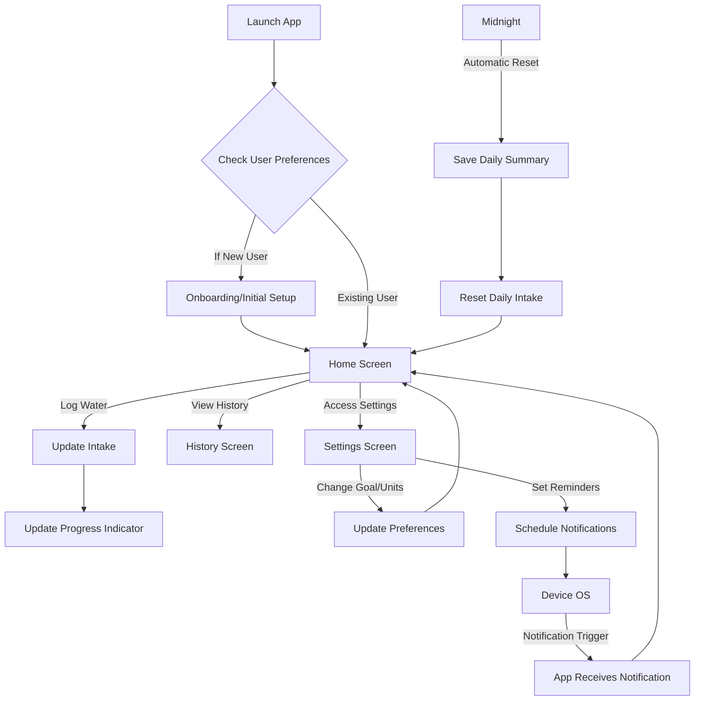

# Hydrate App Design Document

## 1. Overview

The Hydrate app is a Flutter-based mobile application designed to help users track their daily water intake, set personalized hydration goals, and receive timely reminders. The app aims to promote healthy hydration habits through an intuitive user interface, visual progress indicators, and motivational features like achievement badges.

## 2. Detailed Analysis of the Goal or Problem

The primary goal is to create a user-friendly and effective water reminder application. Many individuals struggle to maintain adequate hydration throughout the day, leading to various health issues. This app addresses this problem by providing tools to:

*   **Monitor Intake:** Easily log water consumption.
*   **Set Goals:** Allow users to define their daily water intake targets.
*   **Remind:** Provide timely notifications to encourage consistent hydration.
*   **Visualize Progress:** Offer clear visual feedback on daily progress.
*   **Motivate:** Incorporate historical data, charts, and achievements to keep users engaged.

The app needs to be robust, performant, and adhere to modern Flutter development best practices, including clean architecture, efficient state management, and a visually appealing design.

## 3. Alternatives Considered

### 3.1 State Management

*   **Provider:** A mature and widely adopted solution, easy to learn for simpler states. However, it can become less compile-safe and harder to test in complex scenarios due to its reliance on `BuildContext`.
*   **Riverpod:** A "rethinking" of Provider, offering compile-time safety, improved testability, and no `BuildContext` dependency for provider access. It has a slightly steeper learning curve but provides a more robust and scalable solution for larger applications.

**Decision:** **Riverpod** will be used for state management. While Provider is simpler for basic cases, Riverpod's compile-time safety, enhanced testability, and independence from `BuildContext` make it a superior choice for a maintainable and scalable application like Hydrate, especially with features like daily goals, history, and settings.

### 3.2 Local Storage

*   **`shared_preferences`:** Simple key-value store for primitive data types. Easy to use for small, non-sensitive data like user preferences. Not suitable for complex objects or large datasets.
*   **`Hive`:** A lightweight and fast NoSQL key-value database. Supports custom objects, offers better performance for structured data, and includes encryption options.

**Decision:** **Hive** will be used for local storage. While `shared_preferences` could handle simple settings, the app requires storing daily intake history, user goals, and potentially achievement data, which are better managed as structured objects. Hive's performance, object-oriented capabilities, and encryption support make it ideal for this purpose. `shared_preferences` might be used for very simple, non-critical flags if needed, but Hive will be the primary storage solution.

### 3.3 Notifications

*   **`flutter_local_notifications`:** The standard and most robust package for local notifications across platforms. Provides comprehensive features for scheduling, customization, and handling user interaction.

**Decision:** **`flutter_local_notifications`** will be used. It is the de-facto standard for local notifications in Flutter and provides all the necessary functionalities for scheduling reminders, handling permissions, and customizing notification appearance.

### 3.4 Charts

*   **`fl_chart`:** A powerful and highly customizable Flutter library for various chart types (Line, Bar, Pie, Scatter, Radar). Offers good performance and extensive customization.

**Decision:** **`fl_chart`** will be used. It directly addresses the requirement for charts in the daily intake history and offers the flexibility needed for a modern, water-themed design.

## 4. Detailed Design for the Hydrate App

### 4.1 Architecture

The app will follow a layered architecture, promoting separation of concerns, testability, and maintainability.

*   **Presentation Layer:** Handles the UI and user interactions. Widgets will consume data from the Application Layer.
*   **Application Layer (State Management):** Contains the business logic and manages the application state using Riverpod. This layer will interact with the Domain Layer.
*   **Domain Layer:** Defines the core business entities (e.g., `WaterLog`, `UserPreferences`) and use cases. It is independent of any specific UI or data storage implementation.
*   **Infrastructure Layer:** Implements data storage (Hive), notifications (`flutter_local_notifications`), and any other platform-specific services. This layer provides concrete implementations for interfaces defined in the Domain Layer.

```mermaid
graph TD
    User[User] --> Presentation[Presentation Layer (Widgets)];
    Presentation --> Application[Application Layer (Riverpod Providers)];
    Application --> Domain[Domain Layer (Entities, Use Cases)];
    Domain --> Infrastructure[Infrastructure Layer (Hive, Notifications)];
    Infrastructure --> Device[Device (Local Storage, OS Notifications)];
```

### 4.2 Data Models (Domain Layer)

*   **`WaterLog`**: Represents a single water intake entry.
    ```dart
    class WaterLog {
      final DateTime timestamp;
      final double amountMl; // Amount in milliliters
      // Add other properties like unit if needed, but for internal storage, ml is consistent
    }
    ```
*   **`UserPreferences`**: Stores user-specific settings.
    ```dart
    class UserPreferences {
      double dailyGoalMl;
      String unit; // "ml" or "oz"
      List<int> notificationIntervals; // e.g., [9, 12, 15, 18] for 9 AM, 12 PM, etc.
      bool darkModeEnabled;
      double weightKg; // For recommended intake calculation
      // Add other settings like last reset date for streak, etc.
    }
    ```
*   **`DailySummary`**: Aggregated data for a specific day.
    ```dart
    class DailySummary {
      final DateTime date;
      double totalIntakeMl;
      // Potentially list of WaterLog for that day, or just aggregated data
    }
    ```

### 4.3 State Management (Application Layer - Riverpod)

*   **`WaterIntakeNotifier` (StateNotifierProvider):** Manages the current day's water intake, daily goal, and quick-add functionality.
    *   State: `WaterIntakeState` (current intake, goal, progress, unit).
    *   Methods: `addWater(amountMl)`, `setGoal(goalMl)`, `resetDailyIntake()`.
*   **`UserPreferencesNotifier` (StateNotifierProvider):** Manages user settings.
    *   State: `UserPreferences`.
    *   Methods: `updateGoal(newGoal)`, `updateUnit(newUnit)`, `toggleDarkMode()`, `updateNotificationIntervals()`, `updateWeight(newWeight)`.
*   **`HistoryNotifier` (StateNotifierProvider):** Manages historical water intake data.
    *   State: `List<DailySummary>`.
    *   Methods: `loadHistory()`, `addDailySummary(summary)`.
*   **`NotificationService` (Provider):** Provides an instance of the notification manager.
*   **`LocalStorageService` (Provider):** Provides an instance of the local storage manager (Hive).

### 4.4 Local Storage (Infrastructure Layer - Hive)

*   **`HiveService`:** A wrapper around Hive to handle opening/closing boxes and storing/retrieving data.
*   **Type Adapters:** Custom `TypeAdapter`s will be generated for `WaterLog`, `UserPreferences`, and `DailySummary` to enable efficient storage of these objects.
*   **Boxes:**
    *   `userPreferencesBox`: Stores `UserPreferences`.
    *   `waterLogsBox`: Stores `WaterLog` entries (potentially one box per day or a single box with date as key). A single box with `DateTime` as key for `DailySummary` objects might be more efficient for history.

### 4.5 Notifications (Infrastructure Layer - `flutter_local_notifications`)

*   **`NotificationManager`:** Encapsulates `flutter_local_notifications` logic.
    *   Initialization with platform-specific settings.
    *   Permission handling.
    *   Scheduling daily reminders based on `UserPreferences.notificationIntervals`.
    *   Handling notification taps (e.g., opening the app to the home screen).
    *   `resetCounterAtMidnight` will trigger a notification to reset the daily intake.

### 4.6 UI Design (Presentation Layer)

*   **Theme:** A `ThemeData` will be defined with a water-themed color scheme (blues, aquas) and dark mode support. `ColorScheme.fromSeed` will be used.
*   **Home Screen:**
    *   `WaterProgressIndicator` (Custom Widget): Circular or wave animation showing current intake vs. goal.
    *   `CurrentIntakeDisplay` (Widget): Shows current intake and goal in selected units.
    *   `QuickAddButtons` (Widget): Row of buttons (250ml, 500ml, 1000ml, Custom).
*   **History Screen:**
    *   `DailyChart`, `WeeklyChart`, `MonthlyChart` (Widgets using `fl_chart`): Display historical intake.
    *   Date range selector.
*   **Settings Screen:**
    *   `GoalSetting` (Widget): Slider or input field for daily goal.
    *   `UnitSelector` (Widget): Toggle for ml/oz.
    *   `NotificationPreferences` (Widget): List of toggles/time pickers for reminder intervals.
    *   `WeightInput` (Widget): Input for user's weight to calculate recommended intake.
    *   `DarkModeToggle` (Widget).
*   **Achievements/Streaks:** A dedicated screen or section to display achievement badges and streak counter.

### 4.7 Core Feature Implementation Details

*   **Daily Water Intake Goal:** Stored in `UserPreferences`, managed by `UserPreferencesNotifier`.
*   **Quick-add buttons:** Trigger `WaterIntakeNotifier.addWater()`.
*   **Visual progress indicator:** `WaterProgressIndicator` widget will listen to `WaterIntakeNotifier` state.
*   **Daily intake history with charts:** `HistoryNotifier` will load `DailySummary` data from Hive. `fl_chart` widgets will consume this data.
*   **Local notifications for reminders:** `NotificationManager` will schedule notifications based on `UserPreferences`.
*   **Settings:** `UserPreferencesNotifier` will manage all settings, persisting changes via `LocalStorageService`.
*   **Reset counter at midnight automatically:** A scheduled task (e.g., using `workmanager` or a simple daily check on app launch/resume) will trigger `WaterIntakeNotifier.resetDailyIntake()` and potentially save the day's summary to history.
*   **Calculate recommended intake based on weight:** A utility function in the Domain Layer will calculate this based on `UserPreferences.weightKg` and display it in the settings or goal-setting screen.
*   **Achievement badges and streak counter:** Logic for these will reside in the Application Layer, potentially in a dedicated `AchievementNotifier`, storing data in Hive.

## 5. Diagrams

### 5.1 Application Flow



### 5.2 State Management Interaction

```mermaid
graph TD
    UI[Widgets (Home, History, Settings)] -->|ref.watch/read| Providers[Riverpod Providers];
    Providers -->|update state| UI;
    Providers -->|call methods| UseCases[Domain Use Cases];
    UseCases -->|interact with| Repositories[Infrastructure Repositories];
    Repositories -->|read/write| LocalStorage[Hive Local Storage];
    Repositories -->|schedule/cancel| Notifications[Flutter Local Notifications];

    subgraph Application Layer
        Providers
    end

    subgraph Domain Layer
        UseCases
    end

    subgraph Infrastructure Layer
        Repositories
        LocalStorage
        Notifications
    end
```

## 6. Summary of the Design

The Hydrate app will be built using Flutter, leveraging a clean layered architecture (Presentation, Application, Domain, Infrastructure). Riverpod will manage the application state, providing compile-time safety and testability. Hive will serve as the primary local storage solution for structured data like water logs and user preferences. `flutter_local_notifications` will handle timely reminders, and `fl_chart` will visualize historical intake data. The UI will feature a modern, water-themed design with dark mode support, focusing on an intuitive user experience for tracking and managing hydration goals. Key features include quick-add buttons, a visual progress indicator, daily intake history with charts, customizable settings, automatic daily resets, and future potential for recommended intake calculation and achievement badges.

## 7. References to Research URLs

*   **Flutter State Management (Provider vs Riverpod):**
    *   [https://vertexaisearch.cloud.google.com/grounding-api-redirect/AUZIYQHhy5EE_qSrkivie5Bcii_Cs_LLVe82iDFczvuLARG_V2W2rE19GFGWqPN6UxY6ANYkXcDNFC9A3PWzB9q_ueAhYkJuZv32_z6ep6Pb4GWKvnp1Jt_Zu3jfuaLkmKSvwK3JwDb8IDhNNbL-jRSqhXjKe_21I9xz4L9qEsst25kFq3x6NY22dXLL0OwKWV0idKznpuvNMbMUBoJHVuU7yqK9_GNUhlFYj_hRGCV0qo7ppQKUSg==](https://vertexaisearch.cloud.google.com/grounding-api-redirect/AUZIYQHhy5EE_qSrkivie5Bcii_Cs_LLVe82iDFczvuLARG_V2W2rE19GFGWqPN6UxY6ANYkXcDNFC9A3PWzB9q_ueAhYkJuZv32_z6ep6Pb4GWKvnp1Jt_Zu3jfuaLkmKSvwK3JwDb8IDhNNbL-jRSqhXjKe_21I9xz4L9qEsst25kFq3x6NY22dXLL0OwKWV0idKznpuvNMbMUBoJHVuU7yqK9_GNUhlFYj_hRGCV0qo7ppQKUSg==)
    *   [https://vertexaisearch.cloud.google.com/grounding-api-redirect/AUZIYQEHWpH0pY7LJTFhTR5H_yM-ArZfKKGtEJU4Sh8Q9P70P2FvHYxA7imwGoLLE_4UlW8ipX_RpDwC3vE0EGrdi47nPs_M7B1tXLtJidKQdhLoq-vNtiS8snQPMnYPRFrxQcyXyYu91M6DP2CvrwQBfKgMvXbeJyico_A3bdAlq5L7Bso4Hv09eZA3cgb-vwR_M9UkyrGVs==](https://vertexaisearch.cloud.google.com/grounding-api-redirect/AUZIYQEHWpH0pY7LJTFhTR5H_yM-ArZfKKGtEJU4Sh8Q9P70P2FvHYxA7imwGoLLE_4UlW8ipX_RpDwC3vE0EGrdi47nPs_M7B1tXLtJidKQdhLoq-vNtiS8snQPMnYPRFrxQcyXyYu91M6DP2CvrwQBfKgMvXbeJyico_A3bdAlq5L7Bso4Hv09eZA3cgb-vwR_M9UkyrGVs==)
*   **Flutter Local Storage (shared_preferences vs Hive):**
    *   [https://vertexaisearch.cloud.google.com/grounding-api-redirect/AUZIYQGbjfK24ublNa79SnKEZ84gBjSqsPRPDcBvJ8k4-2O6BU0GEEhMW4-ht0AIHXGpL8FaXLFc_yufH5x5dZpKU2LTDOIu6iTVMkZdiUHJ2dAXduxA2qsrTWR7CTob4UwrqYhMpFo6zHfDX5-EE0XVckoCyl7Nsh7HsX-TCSGi2ZiXHHcOGJ89rEbvSX36iZuaMw==](https://vertexaisearch.cloud.google.com/grounding-api-redirect/AUZIYQGbjfK24ublNa79SnKEZ84gBjSqsPRPDcBvJ8k4-2O6BU0GEEhMW4-ht0AIHXGpL8FaXLFc_yufH5x5dZpKU2LTDOIu6iTVMkZdiUHJ2dAXduxA2qsrTWR7CTob4UwrqYhMpFo6zHfDX5-EE0XVckoCyl7Nsh7HsX-TCSGi2ZiXHHcOGJ89rEbvSX36iZuaMw==)
    *   [https://vertexaisearch.cloud.google.com/grounding-api-redirect/AUZIYQErnvctBCloVi0FD_u3CkmoRe9FuoQu9iEHI5NCed7SSsVfnv-jqp9JaANUQV6YF4OOVwu_Y4GRrlmaeslPDSK7YxlE8dbyB66dQvQbTzJlllBlvGv2NKKNITnH1a3ndB3Jxh4L3Tdi4ty5KsUJjpahkh8fn1aLvjfYc_rYJiexz-bBxBlDLvBfwZ5T2ZId5N1xgfz4iK0fOI3UCtTJyEMJGtrD1YUywfRtP257v_Fo=](https://vertexaisearch.cloud.google.com/grounding-api-redirect/AUZIYQErnvctBCloVi0FD_u3CkmoRe9FuoQu9iEHI5NCed7SSsVfnv-jqp9JaANUQV6YF4OOVwu_Y4GRrlmaeslPDSK7YxlE8dbyB66dQvQbTzJlllBlvGv2NKKNITnH1a3ndB3Jxh4L3Tdi4ty5KsUJjpahkh8fn1aLvjfYc_rYJiexz-bBxBlDLvBfwZ5T2ZId5N1xgfz4iK0fOI3UCtTJyEMJGtrD1YUywfRtP257v_Fo=)
*   **Flutter Local Notifications:**
    *   [https://vertexaisearch.cloud.google.com/grounding-api-redirect/AUZIYQG0uTjeQeVfg2N7GAzBQvAvp5_LzQaGFbmNkKEbrkvXf89QfBw7Y0J6zlIF9oSfflznGs_qDISNxxWRm8qiqcGcceAj_0fufQFa9ufHNGeNa-V5gM4jC4FkCWmLwslYzQEVXyU9MR6D9e0e3QTTwzvRb_08zRckDnln3XQIuI58reLm](https://vertexaisearch.cloud.google.com/grounding-api-redirect/AUZIYQG0uTjeQeVfg2N7GAzBQvAvp5_LzQaGFbmNkKEbrkvXf89QfBw7Y0J6zlIF9oSfflznGs_qDISNxxWRm8qiqcGcceAj_0fufQFa9ufHNGeNa-V5gM4jC4FkCWmLwslYzQEVXyU9MR6D9e0e3QTTwzvRb_08zRckDnln3XQIuI58reLm)
*   **Flutter `fl_chart`:**
    *   [https://vertexaisearch.cloud.google.com/grounding-api-redirect/AUZIYQG0uTjeQeVfg2N7GAzBQvAvp5_LzQaGFbmNkKEbrkvXf89QfBw7Y0J6zlIF9oSfflznGs_qDISNxxWRm8qiqcGcceAj_0fufQFa9ufHNGeNa-V5gM4jC4FkCWmLwslYzQEVXyU9MR6D9e0e3QTTwzvRb_08zRckDnln3XQIuI58reLm](https://vertexaisearch.cloud.google.com/grounding-api-redirect/AUZIYQG0uTjeQeVfg2N7GAzBQvAvp5_LzQaGFbmNkKEbrkvXf89QfBw7Y0J6zlIF9oSfflznGs_qDISNxxWRm8qiqcGcceAj_0fufQFa9ufHNGeNa-V5gM4jC4FkCWmLwslYzQEVXyU9MR6D9e0e3QTTwzvRb_08zRckDnln3XQIuI58reLm)
    *   [https://vertexaisearch.cloud.google.com/grounding-api-redirect/AUZIYQEC_HsvmDk05Y-2HR8Jj_tNAge7BxP9yrgxZOjV0soYySj7OqhsNpuaubmbPzPir-gIr2w8ZRsc0fdpDzWH4hA6SPudd4KZK9x4iLBx8hw3fYJFnFdHhDlNdUBHzpX5uFTFKcmW0mR1zrTPnFjMkCdvKdb6t9EI5N1xgfz4iK0fOI3UCtZ_V533THA=](https://vertexaisearch.cloud.google.com/grounding-api-redirect/AUZIYQEC_HsvmDk05Y-2HR8Jj_tNAge7BxP9yrgxZOjV0soYySj7OqhsNpuaubmbPzPir-gIr2w8ZRsc0fdpDzWH4hA6SPudd4KZK9x4iLBx8hw3fYJFnFdHhDlNdUBHzpX5uFTFKcmW0mR1zrTPnFjMkCdvKdb6t9EI5N1xgfz4iK0fOI3UCtZ_V533THA=)
*   **Mermaid Diagram Syntax:**
    *   [https://vertexaisearch.cloud.google.com/grounding-api-redirect/AUZIYQGw7ZNJZ7zm7VSbPirPdGWW99U-qWbRKCjNIItmzpmZQmGOcWf9AM8ykrqpyKd6ij3TBj4WhAFvXcBVxV1XM14rv5UMBCyDMKtpiEkd0cihxYfQuY1ZL2sn8fk14RWfTBvTtI64VMT2ImVxQMI=](https://vertexaisearch.cloud.google.com/grounding-api-redirect/AUZIYQGw7ZNJZ7zm7VSbPirPdGWW99U-qWbRKCjNIItmzpmZQmGOcWf9AM8ykrqpyKd6ij3TBj4WhAFvXcBVxV1XM14rv5UMBCyDMKtpiEkd0cihxYfQuY1ZL2sn8fk14RWfTBvTtI64VMT2ImVxQMI=)
    *   [https://vertexaisearch.cloud.google.com/grounding-api-redirect/AUZIYQEXYWSuVbtcpvQFxofvSF1z0fA5OPRKfPHfSDNSQPH_F08BkjDdxgU4q4_SRHdP5baWjCRZct-_DxjnsA8SlmzEOvt4x2efCLwyYNvcYao3tfJ6WXHPIPFs4gwtqQKHL-AK2ZZcvQUlUv-jlgmo25vxdeP42On0C-1j](https://vertexaisearch.cloud.google.com/grounding-api-redirect/AUZIYQEXYWSuVbtcpvQFxofvSF1z0fA5OPRKfPHfSDNSQPH_F08BkjDdxgU4q4_SRHdP5baWjCRZct-_DxjnsA8SlmzEOvt4x2efCLwyYNvcYao3tfJ6WXHPIPFs4gwtqQKHL-AK2ZZcvQUlUv-jlgmo25vxdeP42On0C-1j)
